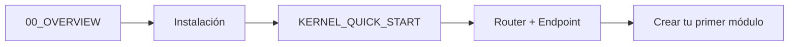
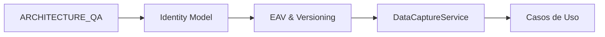

# 📚 Documentación de Bintelx

**Framework Headless Enterprise Agnóstico**

Índice maestro de toda la documentación del proyecto Bintelx.

---

## 🚀 Inicio Rápido

<table>
<tr>
<td width="50%">

### 👨‍💻 Para Desarrolladores

**Primera vez con Bintelx:**
1. 📖 [Arquitectura General](../bintelx/doc/00_OVERVIEW.md)
2. 🔧 [Instalación](../install/README.md)
3. 🎯 [Quick Start del Kernel](./kernel/KERNEL_QUICK_START.md)
4. 🌐 [API Endpoints](../app/api.md)

</td>
<td width="50%">

### 🏢 Para Arquitectos

**Entender el sistema:**
1. 📐 [Arquitectura Core](../bintelx/doc/README.md)
2. 🔍 [Q&A Arquitectura](../bintelx/doc/ARCHITECTURE_QA.md)
3. 📊 [Especificación Target](./database/target.md)
4. 🧬 [Kernel Architecture](./kernel/KERNEL_ARCHITECTURE.md)

</td>
</tr>
</table>

---

## 📂 Documentación por Categoría

### 🏗️ Arquitectura y Diseño

Documentación del diseño arquitectónico del sistema.

| Documento | Descripción | Ubicación |
|-----------|-------------|-----------|
| **Overview** | Introducción conceptual a la arquitectura | [00_OVERVIEW.md](../bintelx/doc/00_OVERVIEW.md) |
| **Identity & Actors** | Sistema Account/Profile/Entity | [01_Identity.md](../bintelx/doc/01_Identity.md) |
| **Roles y Permisos** | Control de acceso basado en relaciones | [02_Roles_and_Permissions.md](../bintelx/doc/02_Roles_and_Permissions.md) |
| **EAV y Versionado** | Sistema de datos versionado (ALCOA+) | [03_EAV_and_Versioning.md](../bintelx/doc/03_EAV_and_Versioning.md) |
| **DataCaptureService** | Servicio de captura de datos auditables | [04_DataCaptureService.md](../bintelx/doc/04_DataCaptureService.md) |
| **Architecture Q&A** | 14 preguntas clave sobre la arquitectura | [ARCHITECTURE_QA.md](../bintelx/doc/ARCHITECTURE_QA.md) |
| **Kernel Architecture** | Arquitectura detallada del kernel | [KERNEL_ARCHITECTURE.md](./kernel/KERNEL_ARCHITECTURE.md) |
| **Alineamiento Arquitectónico** | Resumen de alineación arquitectónica | [ARCHITECTURE_ALIGNMENT_SUMMARY.md](./architecture/ARCHITECTURE_ALIGNMENT_SUMMARY.md) |

---

### 🔧 Instalación y Configuración

Guías paso a paso para instalar y configurar Bintelx.

| Documento | Descripción | Ubicación |
|-----------|-------------|-----------|
| **🌟 Instalación Principal** | Sistema modular de instalación automatizada | [install/README.md](../install/README.md) |
| **Deployment Guide** | Guía de deployment para producción | [install/DEPLOYMENT_GUIDE.md](../install/DEPLOYMENT_GUIDE.md) |
| **Server Setup** | Configuración completa del servidor (Nginx, PHP-FPM, SSL) | [SERVER_SETUP.md](./SERVER_SETUP.md) |
| **Nginx Configuration** | Guía detallada de Nginx (HTTP/3, upstreams, security) | [NGINX_CONFIGURATION.md](./NGINX_CONFIGURATION.md) |
| **Secrets Management** | Sistema de secretos basados en archivos | [SECRETS.md](./SECRETS.md) |
| **Templates System** | Sistema de templates para multi-instancia | [../bintelx/config/server/TEMPLATES.md](../bintelx/config/server/TEMPLATES.md) |
| **Migración a .env** | Migración de configuración hardcoded a .env | [MIGRATION_TO_ENV.md](../MIGRATION_TO_ENV.md) |

---

### 📡 Servicios y Componentes

Documentación de servicios y componentes específicos.

| Documento | Descripción | Ubicación |
|-----------|-------------|-----------|
| **🔌 Channel Server** | Servidor WebSocket/Pub-Sub (Swoole) para tiempo real | [CHANNEL_SERVER.md](./CHANNEL_SERVER.md) |
| **⚡ Async Bus** | Sistema de procesamiento asíncrono agnóstico | [ASYNC_BUS_ARCHITECTURE.md](./ASYNC_BUS_ARCHITECTURE.md) |
| **🌐 Swoole Setup** | Instalación y configuración de Swoole + Nginx | [swoole-nginx-setup.md](./swoole-nginx-setup.md) |
| **Router** | Sistema de enrutamiento de API | [bintelx/doc/Router.md](../bintelx/doc/Router.md) |
| **CONN** | Sistema de conexión a base de datos | [bintelx/doc/CONN.md](../bintelx/doc/CONN.md) |
| **Sequent** | Sistema de secuencias y ordenamiento | [bintelx/doc/SEQUENT_SYSTEM.md](../bintelx/doc/SEQUENT_SYSTEM.md) |
| **Endpoint** | Creación de endpoints personalizados | [bintelx/doc/endpoint.md](../bintelx/doc/endpoint.md) |
| **OpenAPI Generator** | Sistema de documentación OpenAPI automática | [SISTEMA_OPENAPI_DOCUMENTACION.md](../SISTEMA_OPENAPI_DOCUMENTACION.md) |

---

### 🧪 EDC - Electronic Data Capture

Sistema de captura de datos electrónicos (ensayos clínicos).

**📂 [Ver documentación completa EDC](./edc/)**

| Documento | Descripción | Ubicación |
|-----------|-------------|-----------|
| **EDC Specification** | Especificación completa del sistema EDC | [EDC_SPECIFICATION.md](./edc/EDC_SPECIFICATION.md) |
| **EDC Architecture** | Arquitectura refinada del sistema EDC | [EDC_ARCHITECTURE_REFINED.md](./edc/EDC_ARCHITECTURE_REFINED.md) |
| **Hybrid Architecture** | Arquitectura híbrida EDC | [EDC_HYBRID_ARCHITECTURE.md](./edc/EDC_HYBRID_ARCHITECTURE.md) |
| **EDC Installation** | Guía de instalación del módulo EDC | [EDC_INSTALLATION_GUIDE.md](./edc/EDC_INSTALLATION_GUIDE.md) |
| **EDC Frontend Guide** | Guía del frontend EDC | [EDC_FRONTEND_GUIDE.md](./edc/EDC_FRONTEND_GUIDE.md) |
| **EDC Performance** | Análisis de rendimiento | [EDC_PERFORMANCE_ANALYSIS.md](./edc/EDC_PERFORMANCE_ANALYSIS.md) |
| **EDC Goal Completed** | Objetivos completados del EDC | [EDC_GOAL_COMPLETED.md](./edc/EDC_GOAL_COMPLETED.md) |
| **EDC Final Ready** | Estado final y listo para producción | [EDC_FINAL_READY.md](./edc/EDC_FINAL_READY.md) |
| **EDC System Insights** | Insights del sistema EDC | [EDC_SYSTEM_INSIGHTS.md](./edc/EDC_SYSTEM_INSIGHTS.md) |
| **EDC Two Use Cases** | Dos casos de uso principales | [EDC_TWO_USE_CASES.md](./edc/EDC_TWO_USE_CASES.md) |
| **EDC Goal** | Objetivos del EDC | [edc_goal.md](./edc/edc_goal.md) |
| **EDC Schema Opinion** | Opinión sobre esquema EDC | [edc_schema_opinion.md](./edc/edc_schema_opinion.md) |
| **New EDC** | Nuevo diseño EDC | [new_edc.md](./edc/new_edc.md) |

---


### 🛠️ Kernel y Core

Documentación del kernel y componentes core.

**📂 [Ver documentación completa Kernel](./kernel/)**

| Documento | Descripción | Ubicación |
|-----------|-------------|-----------|
| **Kernel README** | Introducción al kernel de Bintelx | [KERNEL_README.md](./kernel/KERNEL_README.md) |
| **Kernel Quick Start** | Inicio rápido con el kernel | [KERNEL_QUICK_START.md](./kernel/KERNEL_QUICK_START.md) |
| **Kernel Reference** | Referencia completa del kernel | [KERNEL_REFERENCE.md](./kernel/KERNEL_REFERENCE.md) |
| **Kernel Architecture** | Arquitectura detallada del kernel | [KERNEL_ARCHITECTURE.md](./kernel/KERNEL_ARCHITECTURE.md) |
| **DataCaptureService Refactor v2** | Refactorización del servicio | [DATACAPTURESERVICE_REFACTOR_v2.0.md](./kernel/DATACAPTURESERVICE_REFACTOR_v2.0.md) |
| **DataCapture API Manual** | Manual de la API de DataCapture | [bintelx/doc/DATACAPTURE_API_MANUAL.md](../bintelx/doc/DATACAPTURE_API_MANUAL.md) |

---

### 🔄 Migraciones y Optimizaciones

Guías de migración y optimizaciones del sistema.

**📂 [Ver documentación completa Migraciones](./migrations/)**

| Documento | Descripción | Ubicación |
|-----------|-------------|-----------|
| **Migration Strategy** | Estrategia general de migraciones | [MIGRATION_STRATEGY.md](./migrations/MIGRATION_STRATEGY.md) |
| **Migration Implementation** | Resumen de implementación | [MIGRATION_IMPLEMENTATION_SUMMARY.md](./migrations/MIGRATION_IMPLEMENTATION_SUMMARY.md) |
| **Migration to .env** | Migración de configuración hardcoded a .env | [MIGRATION_TO_ENV.md](./migrations/MIGRATION_TO_ENV.md) |
| **Snake Case Migration v2.1** | Migración a snake_case | [SNAKE_CASE_MIGRATION_v2.1.md](./migrations/SNAKE_CASE_MIGRATION_v2.1.md) |
| **Migración comp_id a Entities** | Migración de comp_id | [MIGRACION_COMP_ID_A_ENTITIES.md](./migrations/MIGRACION_COMP_ID_A_ENTITIES.md) |
| **Migración Custom Code** | Migración de código custom | [MIGRACION_CUSTOM_CODE.md](./migrations/MIGRACION_CUSTOM_CODE.md) |
| **Encoding UTF8MB4 UCA1400** | Cambio de encoding de base de datos | [CAMBIO_ENCODING_UTF8MB4_UCA1400.md](./migrations/CAMBIO_ENCODING_UTF8MB4_UCA1400.md) |
| **Eliminación Database Adapter** | Eliminación del adapter de DB | [ELIMINACION_DATABASE_ADAPTER.md](./migrations/ELIMINACION_DATABASE_ADAPTER.md) |
| **Optimización CONN Callbacks** | Optimización de callbacks en CONN | [OPTIMIZACION_CONN_CALLBACKS.md](./migrations/OPTIMIZACION_CONN_CALLBACKS.md) |
| **Uso Directo CONN** | Uso directo de CONN sin abstracciones | [USO_DIRECTO_CONN.md](./migrations/USO_DIRECTO_CONN.md) |
| **Flujo Account/Profile/Entity** | Flujo de trabajo con identidades | [FLUJO_ACCOUNT_PROFILE_ENTITY.md](./migrations/FLUJO_ACCOUNT_PROFILE_ENTITY.md) |

---

### 📊 Database y Esquemas

Documentación de esquemas de base de datos.

**📂 [Ver documentación completa Database](./database/)**

| Documento | Descripción | Ubicación |
|-----------|-------------|-----------|
| **Target Specification** | Especificación completa del sistema target | [target.md](./database/target.md) |
| **Sistema Target** | Sistema de target funcionando | [SISTEMA_TARGET_FUNCIONANDO.md](./database/SISTEMA_TARGET_FUNCIONANDO.md) |
| **Target Schema No Alias** | Esquema target sin alias | [TARGET_SCHEMA_NO_ALIAS.md](./database/TARGET_SCHEMA_NO_ALIAS.md) |
| **ALTER TABLE Guide** | Guía para modificar tablas | [ALTER_TABLE_GUIDE.md](./database/ALTER_TABLE_GUIDE.md) |
| **EDC Tables v4** | Tablas EDC escalables | [edc_tables_v4_scalable.sql](./database/edc_tables_v4_scalable.sql) |
| **EDC Tables** | Tablas EDC original | [edc_tables.sql](./database/edc_tables.sql) |
| **Schema SQL** | Esquema principal de BD | [bintelx/config/server/schema.sql](../bintelx/config/server/schema.sql) |
| **DataCaptureService SQL** | Esquema del servicio de captura | [bintelx/doc/DataCaptureService.sql](../bintelx/doc/DataCaptureService.sql) |

---

### 🧪 Testing

Documentación de tests y validaciones.

| Documento | Descripción | Ubicación |
|-----------|-------------|-----------|
| **Test README** | Guía general de tests | [app/test/README.md](../app/test/README.md) |
| **EDC Test README** | Tests del módulo EDC | [app/test/EDC_README.md](../app/test/EDC_README.md) |

---

### 🏗️ Arquitectura

Decisiones arquitectónicas y documentación de diseño.

**📂 [Ver documentación completa Arquitectura](./architecture/)**

| Documento | Descripción | Ubicación |
|-----------|-------------|-----------|
| **Architecture Alignment** | Resumen de alineamiento arquitectónico | [ARCHITECTURE_ALIGNMENT_SUMMARY.md](./architecture/ARCHITECTURE_ALIGNMENT_SUMMARY.md) |

---

### 📝 Sesiones y Notas

Resúmenes de sesiones de desarrollo y decisiones.

**📂 [Ver documentación completa Sesiones](./sessions/)**

| Documento | Descripción | Ubicación |
|-----------|-------------|-----------|
| **Session Summary EDC v4.0** | Sesión completa EDC v4.0 SCALABLE (2025-11-16) | [SESSION_SUMMARY.md](./sessions/SESSION_SUMMARY.md) |
| **Sistema OpenAPI** | Sistema de documentación OpenAPI automática (2025-11-14) | [SISTEMA_OPENAPI_DOCUMENTACION.md](./sessions/SISTEMA_OPENAPI_DOCUMENTACION.md) |
| **Claude MD** | Notas de Claude | [CLAUDE.md](../CLAUDE.md) |
| **Documentación Completa** | Texto completo de documentación | [DOCUMENTACION_COMPLETA.txt](../DOCUMENTACION_COMPLETA.txt) |

---

## 🎯 Flujos de Lectura Recomendados

### Para Nuevos Desarrolladores



**Ruta:**
1. [00_OVERVIEW.md](../bintelx/doc/00_OVERVIEW.md) - Conceptos fundamentales
2. [install/README.md](../install/README.md) - Instalar Bintelx
3. [KERNEL_QUICK_START.md](./kernel/KERNEL_QUICK_START.md) - Primeros pasos con el kernel
4. [Router.md](../bintelx/doc/Router.md) + [endpoint.md](../bintelx/doc/endpoint.md) - Crear endpoints
5. Crear tu primer módulo custom

---

### Para Arquitectos de Solución



**Ruta:**
1. [ARCHITECTURE_QA.md](../bintelx/doc/ARCHITECTURE_QA.md) - Preguntas clave
2. [01_Identity.md](../bintelx/doc/01_Identity.md) - Modelo de identidad
3. [03_EAV_and_Versioning.md](../bintelx/doc/03_EAV_and_Versioning.md) - Sistema de datos
4. [04_DataCaptureService.md](../bintelx/doc/04_DataCaptureService.md) - Servicio principal
5. [Test Suite](../app/test/) - Casos de uso ejecutables

---

### Para DevOps / SysAdmin


**Ruta:**
1. [install/README.md](../install/README.md) - Instalación automatizada
2. [SERVER_SETUP.md](./SERVER_SETUP.md) - Configuración completa del servidor
3. [NGINX_CONFIGURATION.md](./NGINX_CONFIGURATION.md) - Nginx en detalle
4. [SECRETS.md](./SECRETS.md) - Gestión de secretos
5. [CHANNEL_SERVER.md](./CHANNEL_SERVER.md) - Servidor en tiempo real
6. [TEMPLATES.md](../bintelx/config/server/TEMPLATES.md) - Multi-instancia

---

### Para Implementadores de EDC


**Ruta:**
1. [EDC_SPECIFICATION.md](./edc/EDC_SPECIFICATION.md) - Especificación completa
2. [EDC_ARCHITECTURE_REFINED.md](./edc/EDC_ARCHITECTURE_REFINED.md) - Arquitectura refinada
3. [EDC_HYBRID_ARCHITECTURE.md](./edc/EDC_HYBRID_ARCHITECTURE.md) - Arquitectura híbrida
4. [EDC_INSTALLATION_GUIDE.md](./edc/EDC_INSTALLATION_GUIDE.md) - Instalación paso a paso
5. [EDC_FRONTEND_GUIDE.md](./edc/EDC_FRONTEND_GUIDE.md) - Guía del frontend
6. [EDC_PERFORMANCE_ANALYSIS.md](./edc/EDC_PERFORMANCE_ANALYSIS.md) - Análisis de performance
7. [app/test/EDC_README.md](../app/test/EDC_README.md) - Tests y casos de uso

---

## 🔍 Búsqueda Rápida

### Por Tema

| Busco... | Ir a... |
|----------|---------|
| **Conceptos fundamentales** | [00_OVERVIEW.md](../bintelx/doc/00_OVERVIEW.md) |
| **Instalar Bintelx** | [install/README.md](../install/README.md) |
| **Crear endpoints** | [endpoint.md](../bintelx/doc/endpoint.md) |
| **Autenticación JWT** | [SECRETS.md](./SECRETS.md) + [Router.md](../bintelx/doc/Router.md) |
| **Base de datos** | [CONN.md](../bintelx/doc/CONN.md) + [schema.sql](../bintelx/config/server/schema.sql) |
| **Versionado de datos** | [03_EAV_and_Versioning.md](../bintelx/doc/03_EAV_and_Versioning.md) |
| **Sistema de roles** | [02_Roles_and_Permissions.md](../bintelx/doc/02_Roles_and_Permissions.md) |
| **WebSockets/Chat** | [CHANNEL_SERVER.md](./CHANNEL_SERVER.md) |
| **Router Híbrido WS+REST** | [CHECKPOINT.md](./CHECKPOINT.md) |
| **Async Jobs/Workers** | [ASYNC_BUS_ARCHITECTURE.md](./ASYNC_BUS_ARCHITECTURE.md) |
| **Nginx/SSL/HTTPS** | [SERVER_SETUP.md](./SERVER_SETUP.md) |
| **Swoole + Nginx** | [swoole-nginx-setup.md](./swoole-nginx-setup.md) |
| **Múltiples instancias** | [TEMPLATES.md](../bintelx/config/server/TEMPLATES.md) |
| **Ensayos clínicos** | [EDC_SPECIFICATION.md](./edc/EDC_SPECIFICATION.md) |
| **Migrar a .env** | [MIGRATION_TO_ENV.md](./migrations/MIGRATION_TO_ENV.md) |

---

### Por Tecnología

| Tecnología | Documentación |
|------------|---------------|
| **PHP 8.4** | [KERNEL_REFERENCE.md](./kernel/KERNEL_REFERENCE.md) |
| **MySQL** | [CONN.md](../bintelx/doc/CONN.md) |
| **Nginx** | [NGINX_CONFIGURATION.md](./NGINX_CONFIGURATION.md) |
| **Swoole** | [CHANNEL_SERVER.md](./CHANNEL_SERVER.md) |
| **WebSocket** | [CHANNEL_SERVER.md](./CHANNEL_SERVER.md) + [swoole-nginx-setup.md](./swoole-nginx-setup.md) |
| **Swoole 6.x** | [swoole-nginx-setup.md](./swoole-nginx-setup.md) + [ASYNC_BUS_ARCHITECTURE.md](./ASYNC_BUS_ARCHITECTURE.md) |
| **Async/Task Workers** | [ASYNC_BUS_ARCHITECTURE.md](./ASYNC_BUS_ARCHITECTURE.md) |
| **JWT** | [SECRETS.md](./SECRETS.md) + [account-creation-changes.md](./account-creation-changes.md) |
| **HTTP/3 QUIC** | [SERVER_SETUP.md](./SERVER_SETUP.md) |
| **Docker** | [DEPLOYMENT_GUIDE.md](../install/DEPLOYMENT_GUIDE.md) |
| **Systemd** | [TEMPLATES.md](../bintelx/config/server/TEMPLATES.md) |

---

## 📈 Estado de la Documentación

### ✅ Completamente Documentado

- ✅ Arquitectura Core
- ✅ Instalación y Setup
- ✅ Servidor (Nginx, PHP-FPM, SSL)
- ✅ Channel Server (Swoole/WebSocket)
- ✅ Router Híbrido (REST vía WebSocket)
- ✅ Async Bus Architecture (Task Workers)
- ✅ Sistema de Secretos
- ✅ Templates Multi-instancia
- ✅ EDC Module (Electronic Data Capture)
- ✅ JWT con Profile ID

### 🚧 En Desarrollo

- 🚧 Frontend Framework
- 🚧 Módulos Custom específicos
- 🚧 Tests unitarios completos

### 📋 Pendiente

- ⏳ API Reference completa (auto-generada con OpenAPI)
- ⏳ Video tutoriales
- ⏳ Cookbook de recetas comunes

---

## 🤝 Contribuir

### Agregar Nueva Documentación

1. **Crear documento en categoría apropiada**
   - `/docs/` - Infraestructura, servidor, servicios
   - `/bintelx/doc/` - Core, arquitectura, kernel
   - `/install/` - Instalación y deployment
   - `/*.md` (raíz) - Migraciones, cambios grandes, notas de sesión

2. **Formato recomendado:**
   ```markdown
   # Título del Documento

   Descripción breve en 1-2 líneas.

   ## Tabla de Contenidos
   ...

   **Última actualización:** YYYY-MM-DD
   ```

3. **Actualizar este índice:**
   - Agregar entrada en la tabla correspondiente
   - Actualizar sección de "Búsqueda Rápida" si aplica
   - Mantener orden alfabético o lógico

### Estándares de Documentación

- ✅ **Emojis funcionales** en títulos para identificación rápida
- ✅ **Ejemplos de código** con syntax highlighting
- ✅ **Diagramas** en ASCII art o Mermaid
- ✅ **TOC (Table of Contents)** para docs >500 líneas
- ✅ **Links relativos** entre documentos
- ✅ **Fecha de última actualización** al final

---

## 📞 Soporte

**¿No encuentras lo que buscas?**

1. **Buscar en archivos:** `grep -r "término" /var/www/bintelx/`
2. **Revisar tests:** `/var/www/bintelx/app/test/`
3. **Logs del sistema:** `/var/www/bintelx/log/`
4. **Issue tracker:** (URL del proyecto)

---

## 📊 Estadísticas

- **Total documentos:** 70+
- **Categorías principales:** 10 (Arquitectura, Instalación, Servicios, EDC, Kernel, Migraciones, Database, Testing, Async/Real-time, Sesiones)
- **Subdirectorios organizados:** 6 (docs/edc, docs/kernel, docs/migrations, docs/database, docs/architecture, docs/sessions)
- **Líneas totales:** ~50,000+
- **Idiomas:** Español / Inglés
- **Formato:** Markdown
- **README por categoría:** 7 archivos índice

---

**🎉 Bintelx Framework**
*Enterprise. Agnostic. Auditable. Scalable. Real-time.*

**Características principales:**
- 🏗️ Framework headless enterprise
- 🔄 Arquitectura agnóstica (HTTP, WebSocket, CLI)
- ⚡ Procesamiento asíncrono con Swoole
- 🔐 Multi-tenant con Account/Profile/Entity
- 📊 Versionado ALCOA+ compliant
- 🌐 Router Híbrido (REST + WebSocket unificados)
- 🚀 Real-time con Pub/Sub channels

**Última actualización:** 2025-11-25
**Versión docs:** 2.2 - Async Bus y Router Híbrido agregados
